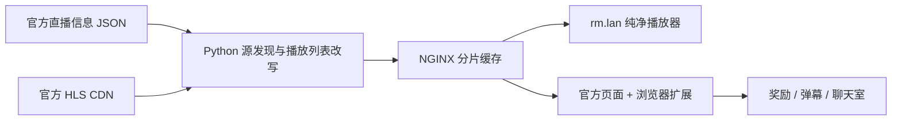
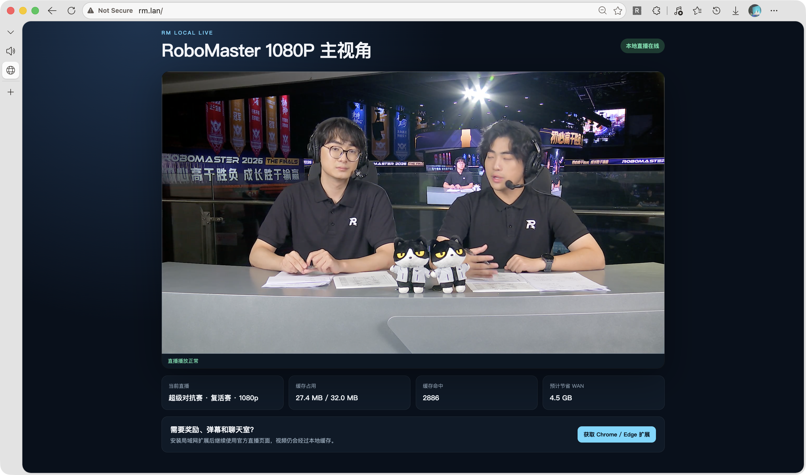
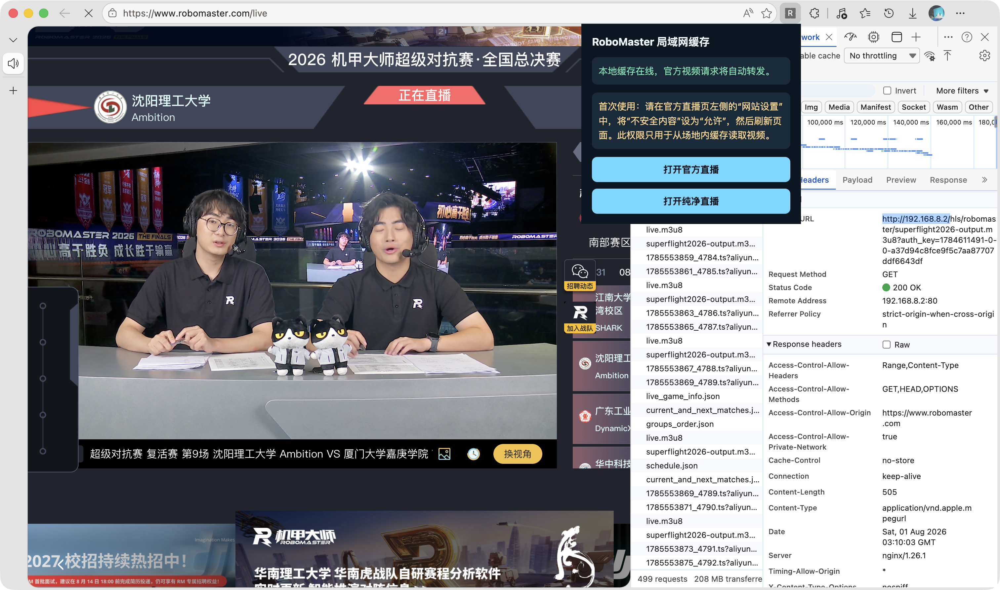

# RoboMaster 局域网直播缓存

面向 RoboMaster 比赛场地局域网的单源 HLS 缓存方案。它在 GL.iNet Slate 7 / OpenWrt 路由器上复用现有 NGINX 与 Python 运行时，将官方标记为 `720p`、`middle` 的主视角直播分片缓存到路由器，供多台终端共享，减少重复占用 WAN 带宽。

项目同时提供两种观看方式：

- **纯净直播**：直接访问 `http://rm.lan/`，不加载奖励、弹幕和聊天室。
- **官方页面增强**：安装 Chrome / Edge 扩展后继续访问 RoboMaster 官方直播页，保留登录、观看时长奖励、弹幕和聊天室，视频请求改走局域网缓存。

> [!IMPORTANT]
> 本项目按一台实际使用的 Slate 7 定制，默认 LAN 为 `192.168.8.0/24`，路由器为 `192.168.8.1`，缓存服务使用 `192.168.8.2`。部署前请确认该地址未被占用，并阅读“适用环境与限制”。

## 工作原理



Python 服务定期读取官方直播信息，严格匹配 `res=middle` 且 `label=720p` 的主视角源，不回退到 1080p。它会改写 HLS 播放列表、合并同一分片的并发请求，并将分片交给 NGINX 从 `/tmp` 高效发送。实际编码参数仍以赛事 CDN 返回内容为准。

## 主要功能

- 单一 720p 主视角，避免不同清晰度分散缓存命中率。
- 多客户端请求同一分片时只回源一次，其余请求复用结果。
- 默认最多使用 32 MiB 临时缓存，分片默认保留 300 秒。
- 自带响应式纯净播放器、健康检查与缓存统计页面。
- Chrome / Edge Manifest V3 扩展保留官方页面功能。
- 通过 nftables 阻止 LAN 客户端绕过缓存直连视频 CDN。
- LAN 接口重连后自动恢复 `192.168.8.2` 服务地址。
- 安装前备份相关配置，提供一键完整卸载。

## 适用环境与限制

当前实现面向以下环境：

- GL.iNet Slate 7 或具有相同 OpenWrt 组件布局的设备。
- LAN 网桥名称为 `br-lan`，路由器地址为 `192.168.8.1/24`。
- `192.168.8.2` 未被其他设备使用。
- 已安装并可使用 `python3`、`nginx`、`nft`、`dnsmasq`、`curl`。
- 可选：OpenClash 的透明 TCP 监听端口为 `7892`。

OpenClash 仅用于处理该设备上部分官方站点/CDN 的特殊可达性问题。若端口 `7892` 未监听，脚本不会重定向这些站点，其他流量保持直连。项目不会安装、替换或删除 GL.iNet 软件包，也不会修改 OpenClash 配置。

## 快速部署

先在本机克隆项目：

```sh
git clone https://github.com/ZhichuCen/RMLiveCache.git
cd RMLiveCache
```

将安装文件上传到路由器；请把 `ROUTER_IP` 替换为实际管理地址：

```sh
ssh root@ROUTER_IP 'mkdir -p /tmp/rm-live-cache-install'
scp -r router packaging extension rm-live-cache-extension.zip \
  root@ROUTER_IP:/tmp/rm-live-cache-install/
```

登录路由器并执行安装：

```sh
ssh root@ROUTER_IP
sh /tmp/rm-live-cache-install/packaging/install.sh \
  /tmp/rm-live-cache-install
```

安装完成后可删除上传目录以节省路由器空间：

```sh
rm -rf /tmp/rm-live-cache-install
```

## 访问入口

| 地址 | 用途 |
| --- | --- |
| `http://rm.lan/` | 推荐的纯净直播页面 |
| `http://rm.local/` | 兼容别名；可能与 mDNS `.local` 行为冲突 |
| `http://192.168.8.2/` | 固定 IP 入口及扩展使用的传输地址 |
| `http://rm.lan/live.m3u8` | 当前主视角 HLS 入口 |
| `http://rm.lan/health` | 简洁健康检查 |
| `http://rm.lan/api/status` | 直播源、缓存、命中和 WAN 节省统计 |
| `http://rm.lan/extension/` | 扩展下载与安装说明 |

## 安装浏览器扩展

1. 打开 `http://rm.lan/extension/` 下载扩展 ZIP 并解压。
2. 进入 `chrome://extensions/` 或 `edge://extensions/`。
3. 开启“开发者模式”，选择“加载已解压的扩展程序”。
4. 选择解压后的扩展目录，而不是 ZIP 文件本身。
5. 打开 RoboMaster 官方直播页，在该站点的权限设置中允许“不安全内容”，然后刷新页面。

允许“不安全内容”是因为 HTTPS 官方页面需要读取场地内的 HTTP HLS 服务。扩展只对 `www.robomaster.com/live` 与本地缓存地址声明权限，并只改写对应直播请求。

## 运维与验证

```sh
# 服务状态与重启
/etc/init.d/rm-live-cache status
/etc/init.d/rm-live-cache restart

# 接口检查
curl -fsS http://rm.lan/health
curl -fsS http://rm.lan/api/status
curl -fsSL http://rm.lan/live.m3u8

# 查看服务日志
logread -e rm-live-cache
```

默认参数位于 `router/etc/rm-live-cache/config.json`：

| 参数 | 默认值 | 说明 |
| --- | ---: | --- |
| `source_resolution` | `middle` | 官方直播源清晰度标识 |
| `source_label` | `720p` | 官方直播源显示标签 |
| `cache_max_bytes` | `33554432` | 分片缓存上限，32 MiB |
| `segment_ttl_seconds` | `300` | 分片保留时间 |
| `playlist_ttl_seconds` | `0.8` | 上游播放列表刷新间隔 |
| `source_ttl_seconds` | `10` | 直播信息刷新间隔 |
| `upstream_timeout_seconds` | `12` | 上游请求超时 |

修改源码配置后需要重新上传相应文件并重启服务。缓存位于 `/tmp/rm-live-cache`，路由器重启或服务停止后会自动清理。

## 完整卸载

```sh
/usr/sbin/rm-live-cache-uninstall
```

卸载脚本会停止并禁用服务，删除 NGINX 虚拟主机、DNS 别名、nftables 表、Web 页面、扩展包、自恢复脚本与临时缓存，并恢复安装前备份的相关配置。GL.iNet 软件包和 OpenClash 配置不会被删除。

## 安全说明

- 安装和卸载都需要路由器 `root` 权限，请先审阅脚本。
- nftables 规则会阻断 `br-lan` 客户端直连 `rtmp.djicdn.com` 的 TCP/UDP 443；路由器本机仍可回源。
- `rm.lan` 是纯 HTTP，仅建议用于可信的场地局域网。
- 项目不代理账号、奖励、弹幕或聊天室数据；这些仍由浏览器直接访问官方服务。
- 不要把路由器备份、密码或私有配置提交到公开仓库。

## 项目结构

```text
extension/                      Chrome / Edge 扩展源码
packaging/                      安装与卸载脚本
router/etc/                     NGINX、nftables、init 与配置文件
router/usr/lib/rm-live-cache/   Python 缓存协调服务与防火墙脚本
router/www/rm-live-cache/       纯净播放器和本地扩展下载页
tests/                          直播源选择测试
rm-live-cache-extension.zip     可直接分发的扩展包
```

## 效果展示

> 下列截图来自早期 1080p 部署，仅展示页面与扩展工作方式；当前代码配置为官方 720p/middle 源。

### 纯净直播与缓存统计



### 官方页面保留奖励、弹幕和聊天室


